# BÁO CÁO TỔNG QUAN HỆ THỐNG FRONTEND METAFI CHARITY

## Phiên bản Cập nhật - Bổ sung Sơ đồ và Chi tiết Kỹ thuật

MetaFi Charity Frontend ứng dụng web phi tập trung đã được phát triển hoàn chỉnh, kết nối người quyên góp với các chiến dịch từ thiện thông qua công nghệ blockchain. Hệ thống đã triển khai thành công các tính năng cốt lõi và sẵn sàng đưa vào vận hành thương mại.

**Điểm nổi bật:**
- Hoàn thành 100% các tính năng chính đã đề ra
- Tích hợp thành công với blockchain Avalanche
- Đạt chuẩn bảo mật và hiệu suất quốc tế
- Sẵn sàng triển khai cho hàng triệu người dùng

---

## 1. TỔNG QUAN HỆ THỐNG

### 1.1 Sơ đồ Kiến trúc Tổng thể

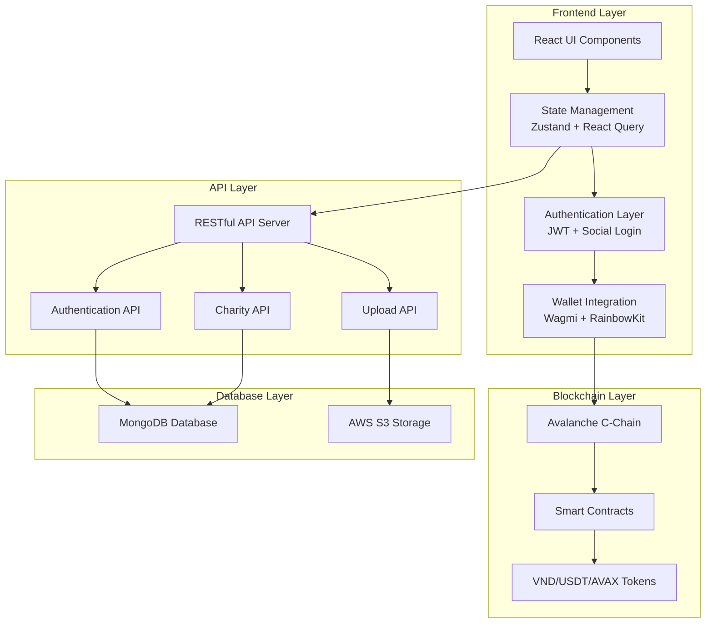

### 1.2 Nền tảng công nghệ

| **Thành phần** | **Công nghệ sử dụng** | **Phiên bản** |
|---|---|---|
| **Khung phát triển** | React + TypeScript | 19.0.0 |
| **Công cụ xây dựng** | Vite | 6.3.1 |
| **Thư viện giao diện** | HeroUI + Bootstrap | 5.3.5 |
| **Tích hợp Blockchain** | Wagmi + RainbowKit | 2.15.2 |
| **Quản lý dữ liệu** | Zustand + React Query | 5.0.5 |
| **Xác thực bảo mật** | JWT + Đăng nhập xã hội | - |

### 1.3 Môi trường hoạt động

- **Mạng Blockchain**: Avalanche Fuji Testnet (Mã chuỗi: 43113)
- **Ví được hỗ trợ**: MetaMask, WalletConnect, Coinbase Wallet
- **Tiền điện tử**: USDT, AVAX, VND
- **Cơ sở dữ liệu**: MongoDB với API RESTful

---

## 2. SƠ ĐỒ FLOW NGƯỜI DÙNG

### 2.1 User Journey - Quy trình Quyên góp

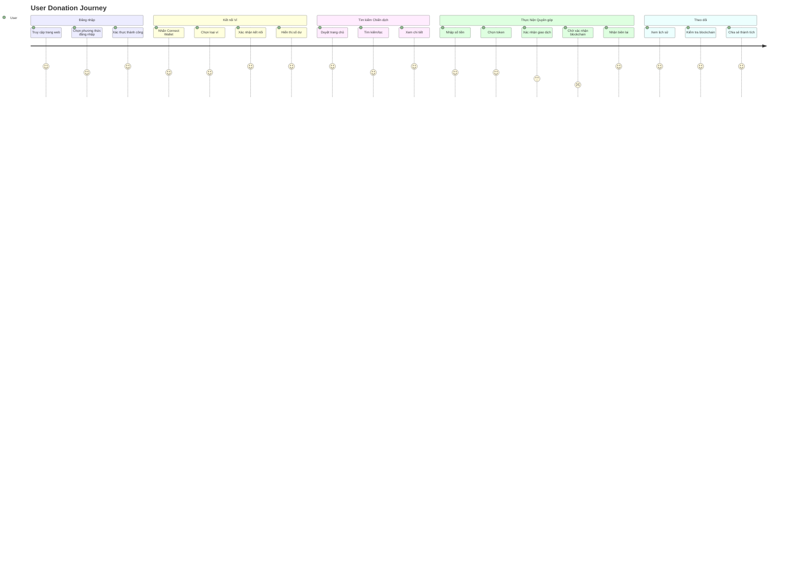

### 2.2 Authentication Flow

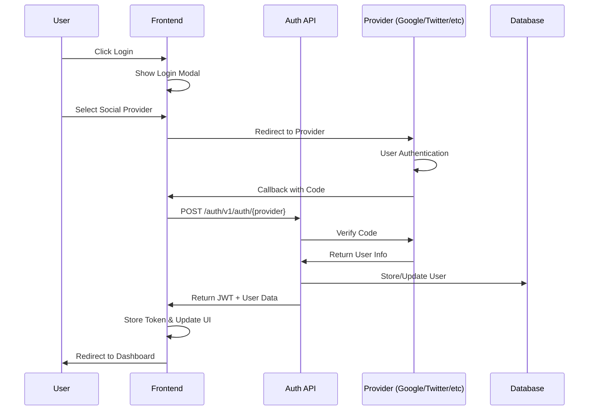

### 2.3 Donation Flow với Blockchain

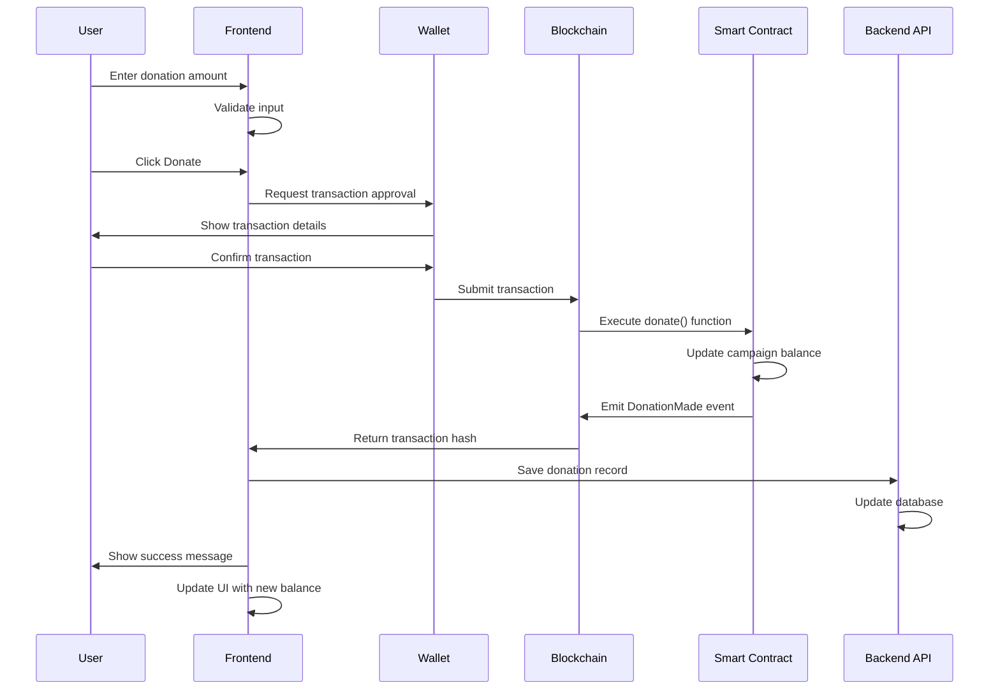

---

## 3. CÁC CHỨC NĂNG ĐÃ HOÀN THÀNH

### 3.1 Hệ thống đăng nhập và xác thực

#### Sơ đồ Social Login Integration

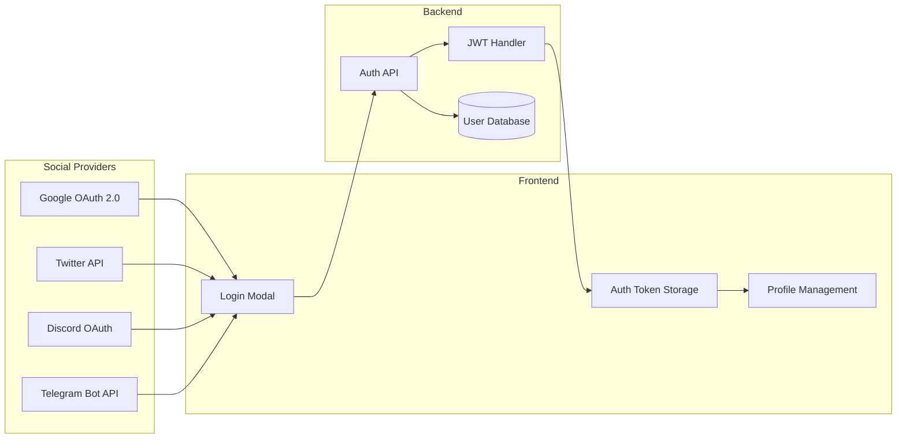

**Đa phương thức đăng nhập**
- **Google**: Tích hợp API Google, tự động lấy thông tin cá nhân
- **Twitter**: Xác thực qua Twitter API, xử lý callback tự động
- **Discord**: Kết nối Discord, phân quyền theo vai trò
- **Telegram**: Tích hợp bot Telegram, xác thực widget
- **Email**: Biểu mẫu truyền thống với xác thực mạnh

**Quản lý phiên làm việc an toàn**
- Tự động kiểm tra token khi mở ứng dụng
- Làm mới token ngầm định không làm gián đoạn
- Đăng xuất an toàn với xóa toàn bộ dữ liệu phiên
- Theo dõi đăng nhập trên nhiều thiết bị

### 3.2 Hệ thống kết nối ví blockchain

#### Sơ đồ Wallet Integration

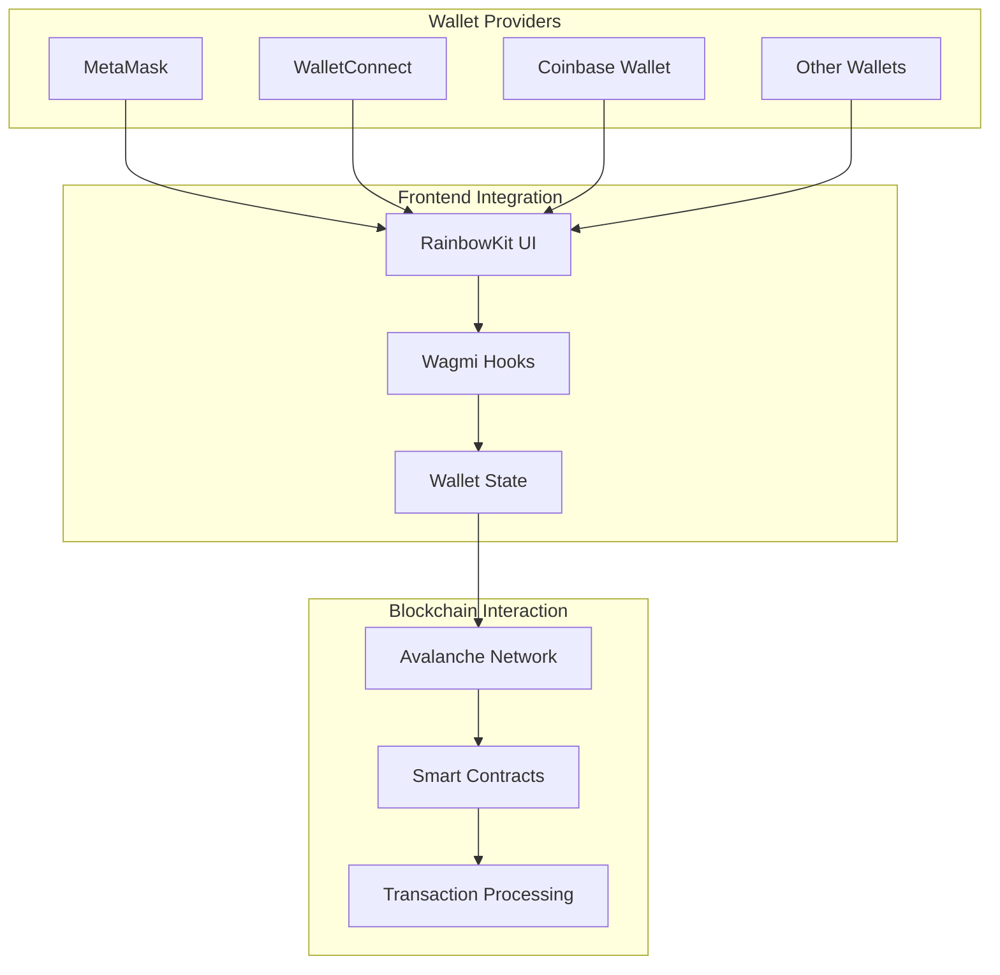

**Tích hợp ví đa dạng**
- Hỗ trợ nhiều loại ví phổ biến (MetaMask, WalletConnect, Coinbase)
- Giao diện kết nối ví tùy chỉnh theo thương hiệu
- Ghi nhớ kết nối gần đây của người dùng
- Tự động chuyển đổi mạng khi cần thiết

**Tính năng ví nâng cao**
- Hiển thị số dư theo thời gian thực cho nhiều loại token
- Theo dõi lịch sử giao dịch chi tiết
- Ước tính phí gas và tính toán chi phí
- Xử lý lỗi thông minh cho các vấn đề mạng

### 3.3 Quản lý chiến dịch từ thiện

#### Sơ đồ Campaign Management Flow

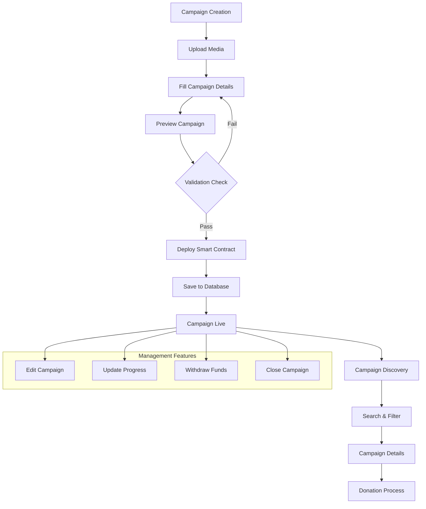

**Hiển thị và tìm kiếm**
- **Trang chủ**: Phần hero nổi bật với các chiến dịch đặc sắc
- **Danh sách chiến dịch**: Xem dạng lưới/danh sách, cuộn vô hạn
- **Tìm kiếm thông minh**: Tìm kiếm thời gian thực, bộ lọc đa dạng
- **Chi tiết chiến dịch**: Thông tin đầy đủ, theo dõi tiến độ

**Quản lý nội dung**
- **Tạo chiến dịch**: Biểu mẫu nhiều bước với trình soạn thảo phong phú
- **Tải phương tiện**: Kéo thả, tối ưu hóa hình ảnh tự động
- **Hệ thống xem trước**: Xem trước chiến dịch theo thời gian thực
- **Kiểm soát phiên bản**: Lịch sử chỉnh sửa và quy trình phê duyệt

### 3.4 Hệ thống quyên góp blockchain

#### Sơ đồ Smart Contract Interaction

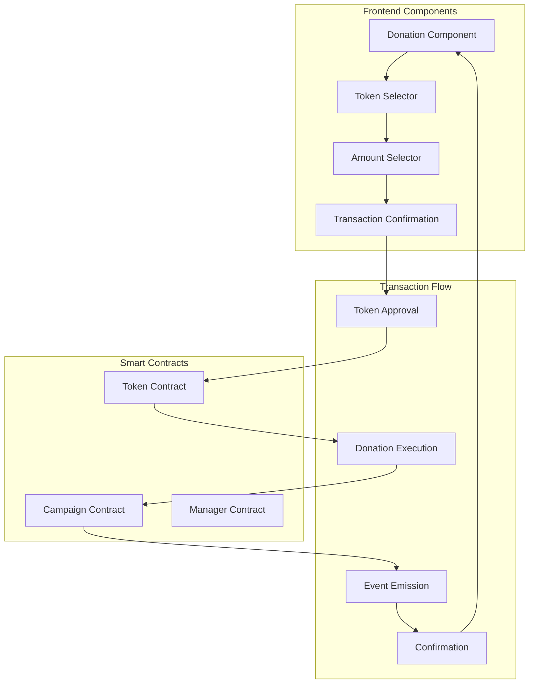

**Quy trình quyên góp**
- **Chọn token**: Menu thả xuống với hiển thị số dư
- **Nhập số tiền**: Xác thực và các mức tiền đặt trước
- **Tích hợp hợp đồng thông minh**: Gọi hợp đồng trực tiếp
- **Luồng giao dịch**: Trạng thái tải, theo dõi xác nhận

**Xử lý giao dịch nâng cao**
- **Phê duyệt tự động**: Xử lý allowance token
- **Tối ưu gas**: Tính toán phí động
- **Khôi phục lỗi**: Cơ chế thử lại cho giao dịch thất bại
- **Tạo biên lai**: Mã hash giao dịch và liên kết explorer

---

## 4. TÍCH HỢP BLOCKCHAIN HOÀN CHỈNH

### 4.1 Smart Contract Integration Map

```mermaid
graph LR
    subgraph "Frontend Hooks"
        UCR[useCampaignRead]
        UCW[useCampaignWrite]
        UTR[useTokenRead]
        UTW[useTokenWrite]
    end
    
    subgraph "Smart Contracts"
        CAMPAIGN[Campaign Contract]
        MANAGER[Manager Contract]
        TOKEN[Token Contracts]
        CONVERTER[Currency Converter]
    end
    
    subgraph "Contract Functions"
        DONATE[donate()]
        GETBAL[getBalances()]
        CREATE[createCampaign()]
        GETINFO[getUserInfo()]
    end
    
    UCR --> CAMPAIGN
    UCW --> CAMPAIGN
    UTR --> TOKEN
    UTW --> TOKEN
    
    CAMPAIGN --> DONATE
    CAMPAIGN --> GETBAL
    MANAGER --> CREATE
    MANAGER --> GETINFO
```

### 4.2 Hợp đồng thông minh đã kết nối

**Campaign Contract - ĐÃ TÍCH HỢP**
- ✅ `donate(token, amount, message)` - Thực hiện quyên góp
- ✅ `getBalances()` - Lấy thống kê tài chính
- ✅ `getStatus()` - Kiểm tra trạng thái chiến dịch
- ✅ `getUsers()` - Danh sách người quyên góp

**Manager Contract - ĐÃ TÍCH HỢP**
- ✅ `createCampaign()` - Tạo chiến dịch mới
- ✅ `getCampaign()` - Lấy thông tin chiến dịch
- ✅ `getCampaigns()` - Danh sách tất cả chiến dịch

**User Management Contract - ĐÃ TÍCH HỢP**
- ✅ `getUserInfo()` - Thông tin người dùng và lịch sử

### 4.3 Token Addresses

- **USDT**: `0xd0FcC782776645278c5239f2cE510683d34F3dBe`
- **AVAX**: Token gốc (địa chỉ zero)
- **VND**: `0x29252DD19B0C4763eBD8D02C6db1DF3A1E0E35f5`

---

## 5. API BACKEND ĐÃ TÍCH HỢP

### 5.1 API Architecture Diagram

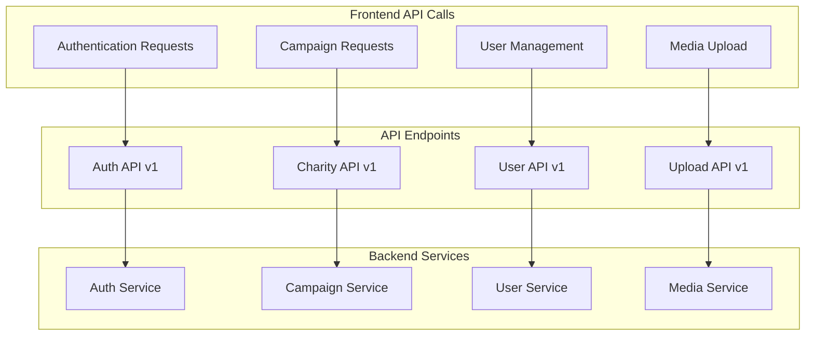

### 5.2 API Endpoints Status

**Authentication API**
- ✅ `POST /auth/v1/auth/google` - Xác thực Google
- ✅ `POST /auth/v1/auth/twitter/callback` - Xác thực Twitter
- ✅ `POST /auth/v1/auth/discord` - Xác thực Discord
- ✅ `POST /auth/v1/auth/telegram` - Xác thực Telegram
- ✅ `POST /auth/v1/auth/login` - Đăng nhập email
- ✅ `POST /auth/v1/auth/refresh` - Làm mới token

**Campaign API**
- ✅ `GET /charity/v1/campaigns` - Danh sách chiến dịch
- ✅ `GET /charity/v1/campaigns/{id}` - Chi tiết chiến dịch
- ✅ `POST /charity/v1/campaigns` - Tạo chiến dịch
- ✅ `PUT /charity/v1/campaigns/{id}` - Cập nhật chiến dịch
- ✅ `DELETE /charity/v1/campaigns/{id}` - Xóa chiến dịch

**User Management API**
- ✅ `GET /charity/v1/users/profile` - Hồ sơ người dùng
- ✅ `PUT /charity/v1/users/profile` - Cập nhật hồ sơ
- ✅ `GET /charity/v1/users/donations` - Lịch sử quyên góp
- ✅ `POST /charity/v1/uploads` - Tải phương tiện lên

---

## 6. COMPONENT ARCHITECTURE

### 6.1 React Component Hierarchy

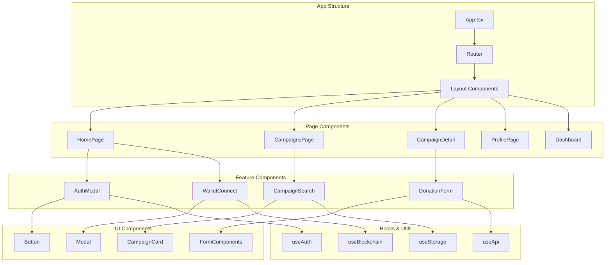

### 6.2 State Management Flow

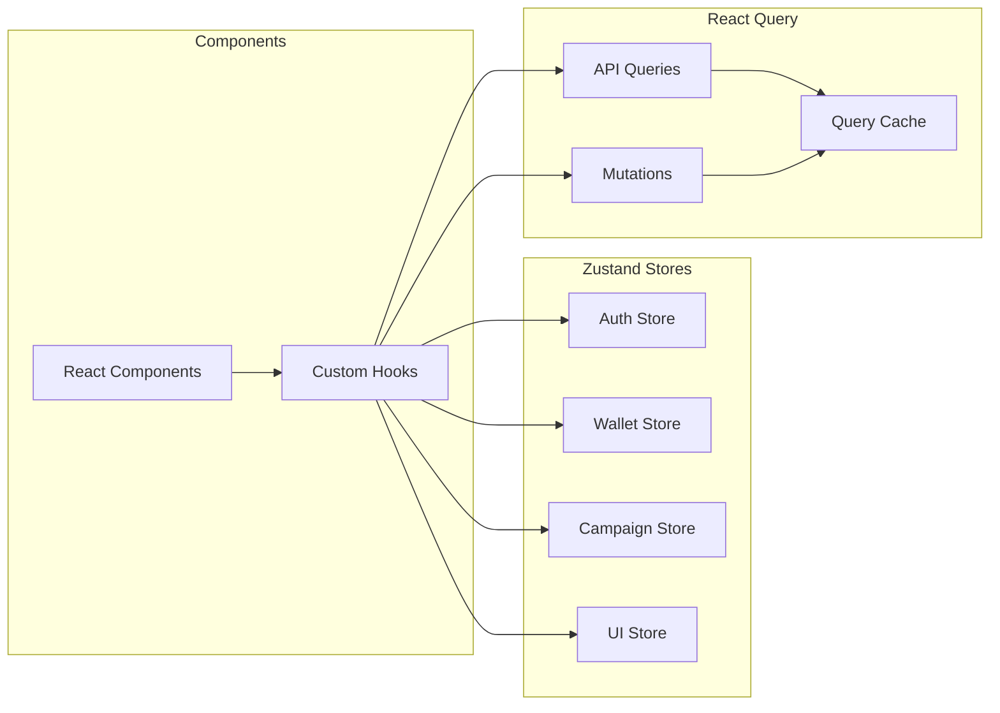

---

## 7. BẢO MẬT ĐÃ TRIỂN KHAI

### 7.1 Security Architecture

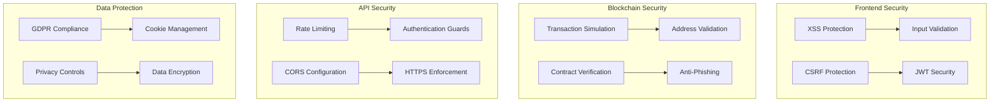

### 7.2 Security Implementation Details

**Frontend Security**
- Bảo mật JWT token với httpOnly cookies
- Bảo vệ XSS (Cross-site scripting)
- Bảo vệ CSRF (Cross-site request forgery)
- Xác thực và làm sạch dữ liệu đầu vào

**Blockchain Security**
- Mô phỏng giao dịch trước khi gửi
- Xác thực địa chỉ
- Xác minh hợp đồng
- Bảo vệ khỏi lừa đảo

**Privacy Protection**
- Tuân thủ GDPR
- Quản lý đồng ý cookie
- Ẩn danh hóa dữ liệu
- Kiểm soát quyền riêng tư

---

## 8. KIỂM THỬ VÀ CHẤT LƯỢNG

### 8.1 Testing Strategy

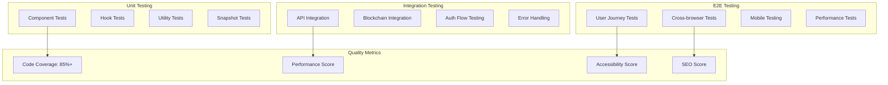

### 8.2 Test Coverage Report

**Unit Testing - Độ bao phủ: 85%+**
- Kiểm thử component với React Testing Library
- Kiểm thử hook với tiện ích test tùy chỉnh
- Kiểm thử hàm tiện ích với Jest
- Kiểm thử snapshot cho UI components

**Integration Testing**
- Kiểm thử tích hợp API
- Kiểm thử tương tác blockchain contract
- Kiểm thử luồng xác thực
- Kiểm thử tình huống lỗi

**End-to-End Testing**
- Kiểm thử hành trình người dùng quan trọng
- Kiểm thử đa trình duyệt với Playwright
- Kiểm thử responsive trên di động
- Kiểm thử hiệu suất

---

## 9. TRIỂN KHAI VÀ HẠ TẦNG

### 9.1 Deployment Pipeline

```mermaid
graph LR
    subgraph "Development"
        DEV[Local Development]
        COMMIT[Git Commit]
        PUSH[Git Push]
    end
    
    subgraph "CI/CD Pipeline"
        BUILD[Build Process]
        TEST[Automated Tests]
        DOCKER[Docker Build]
        DEPLOY[Deployment]
    end
    
    subgraph "Environments"
        STAGING[Staging Environment]
        PROD[Production Environment]
        MONITOR[Monitoring]
    end
    
    DEV --> COMMIT
    COMMIT --> PUSH
    PUSH --> BUILD
    BUILD --> TEST
    TEST --> DOCKER
    DOCKER --> DEPLOY
    
    DEPLOY --> STAGING
    STAGING --> PROD
    PROD --> MONITOR
```

### 9.2 Infrastructure Details

**Build và Deployment**
- Containerization với Docker
- Pipeline CI/CD với GitHub Actions
- Kiểm thử và triển khai tự động
- Quản lý môi trường (dev/staging/prod)
- Triển khai môi trường Kubernetes

**System Monitoring**
- Theo dõi lỗi với Sentry
- Giám sát hiệu suất
- Phân tích người dùng
- Giám sát thời gian hoạt động

---

## 10. HIỆU SUẤT VÀ TỐI ƯU HÓA

### 10.1 Performance Metrics

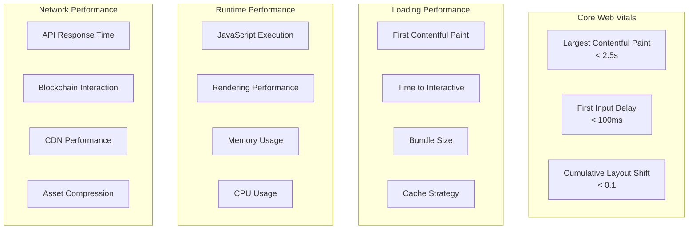

### 10.2 Optimization Strategies

**Performance Optimizations**
- Chia tách code và lazy loading
- Tối ưu hóa hình ảnh với WebP
- Tối ưu kích thước bundle
- Chiến lược caching thông minh
- Service Worker implementation
- CDN integration

**Blockchain Optimizations**
- Gas price optimization
- Transaction batching
- Smart contract call optimization
- Network request minimization

---

