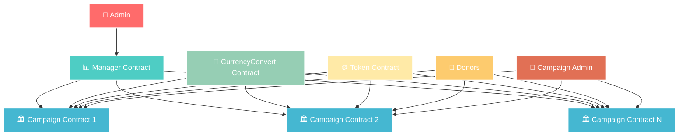
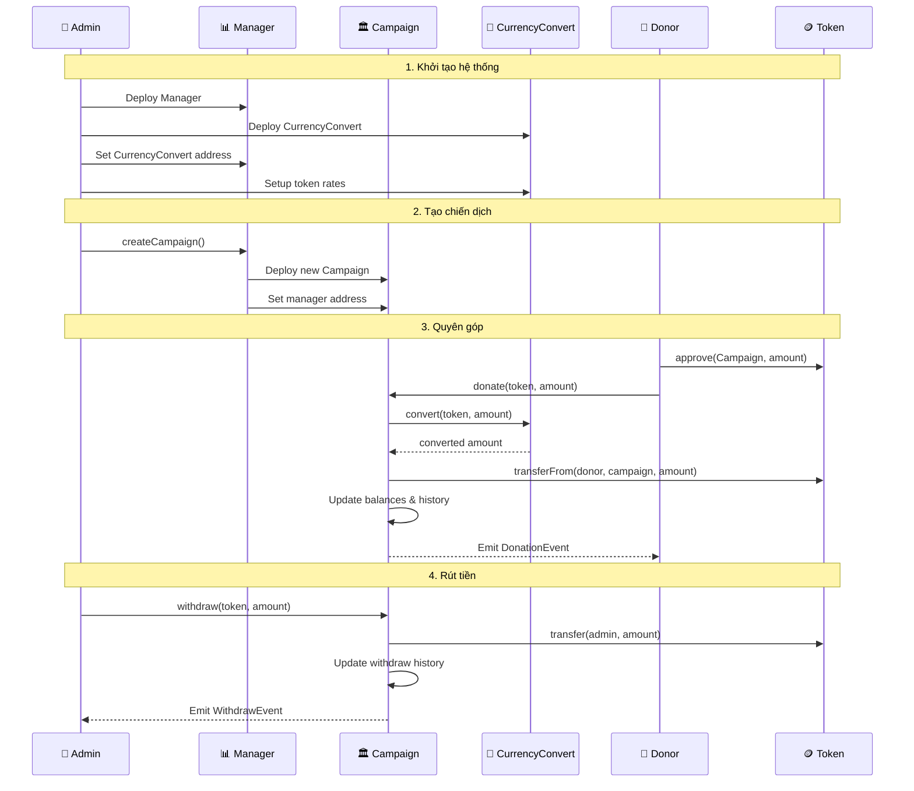
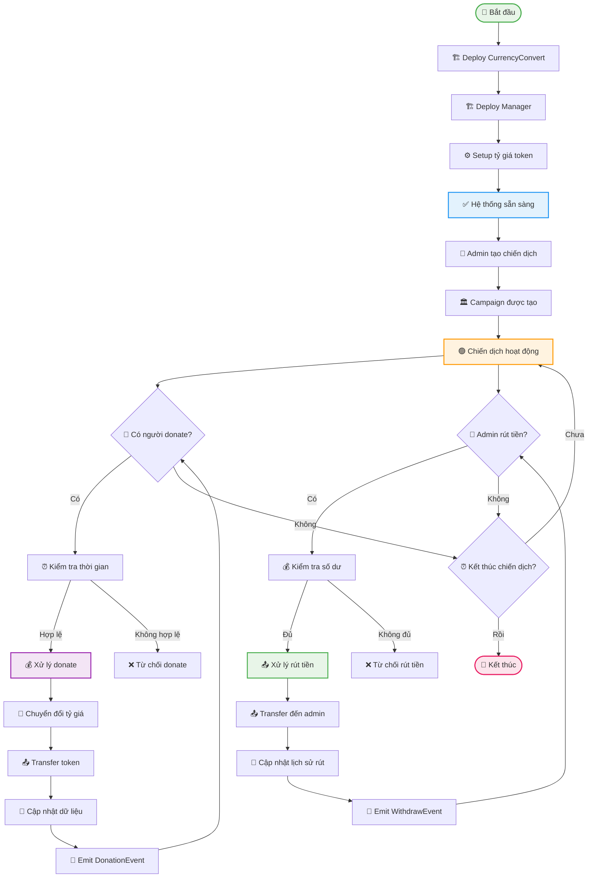
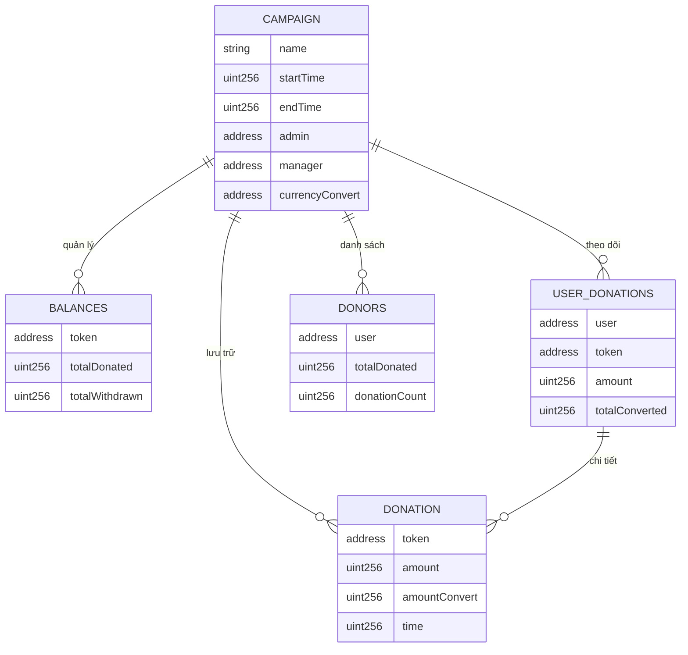

# TÀI LIỆU HỆ THỐNG SMART CONTRACT TỪ THIỆN

## 🎯 Tổng quan hệ thống

Hệ thống smart contract từ thiện được thiết kế để quản lý các chiến dịch quyên góp một cách minh bạch và phi tập trung trên blockchain. Hệ thống bao gồm 4 contract chính hoạt động phối hợp với nhau:

| Contract | Chức năng chính |
|----------|-----------------|
| `Campaign.sol` | Quản lý chiến dịch từ thiện cụ thể |
| `Manager.sol` | Quản lý tập trung nhiều chiến dịch |
| `CurrencyConvert.sol` | Chuyển đổi tỷ giá token |
| `Token.sol` | Token ERC20 mẫu để test |

## 🏗️ Sơ đồ kiến trúc hệ thống



## 🔄 Sơ đồ tương tác giữa các contract



## 📋 1. CAMPAIGN.SOL - Quản lý chiến dịch từ thiện

### Mô tả
Contract chính quản lý một chiến dịch từ thiện, cho phép người dùng donate nhiều loại token, lưu lịch sử giao dịch, rút tiền và phân quyền admin/manager.

### 🏗️ Cấu trúc dữ liệu

#### Biến chính
```solidity
string public name;                    // Tên chiến dịch
uint256 public startTime;              // Thời gian bắt đầu
uint256 public endTime;                // Thời gian kết thúc (0 = không thời hạn)
address public admin;                  // Địa chỉ admin
address public manager;                // Địa chỉ manager
EnumerableSet.AddressSet donors;       // Danh sách người donate
ICurrencyConvert currencyConvert;      // Contract chuyển đổi tỷ giá
```

#### Struct Donation
```solidity
struct Donation {
    address token;         // Địa chỉ token
    uint256 amount;        // Số lượng token gốc
    uint256 amountConvert; // Số lượng sau quy đổi
    uint256 time;          // Thời gian donate
}
```

#### Mapping quan trọng
```solidity
mapping(address => uint256) balances;                    // token => tổng số đã donate
mapping(address => uint256) withdraws;                   // token => số đã rút
mapping(address => uint256) userTotalDonations;          // user => tổng donate quy đổi
mapping(address => mapping(address => uint256)) userDonations; // user => token => số lượng
mapping(address => Donation[]) userDonationsDetail;      // user => chi tiết donate
```

### 🔧 Chức năng chính

#### 1.1. `donate(address _token, uint256 _amount)`

**Mục đích:** Cho phép người dùng donate token hoặc ETH vào chiến dịch

**Tham số:**
- `_token`: Địa chỉ token (address(0) cho ETH)
- `_amount`: Số lượng token/ETH

**Quyền hạn:** Bất kỳ ai (external)

**Quy trình thực hiện:**
1. ✅ Kiểm tra thời gian chiến dịch hợp lệ
2. 💰 Xử lý ETH nếu `_token` là address(0)
3. 🔄 Chuyển đổi tỷ giá thông qua CurrencyConvert
4. 📤 Transfer token từ người dùng vào contract
5. 📝 Cập nhật số dư, danh sách donors, lịch sử
6. 📡 Emit DonationEvent

**Ví dụ sử dụng:**
```solidity
// Donate 100 USDT
campaign.donate(usdtAddress, 100);

// Donate 0.1 ETH
campaign.donate{value: 0.1 ether}(address(0), 0);
```

#### 1.2. `withdraw(address _token, uint256 _amount)`

**Mục đích:** Cho phép admin rút tiền từ chiến dịch

**Tham số:**
- `_token`: Địa chỉ token cần rút
- `_amount`: Số lượng cần rút

**Quyền hạn:** Chỉ admin (onlyAdmin modifier)

**Quy trình thực hiện:**
1. ✅ Kiểm tra số dư khả dụng
2. 📤 Transfer token từ contract đến admin
3. 📝 Cập nhật số đã rút
4. 📡 Emit WithdrawEvent

**Ví dụ sử dụng:**
```solidity
// Rút 1000 USDT
campaign.withdraw(usdtAddress, 1000);
```

#### 1.3. `setupAdmin(address _admin)`

**Mục đích:** Thay đổi admin của chiến dịch

**Tham số:**
- `_admin`: Địa chỉ admin mới

**Quyền hạn:** Chỉ manager (onlyManager modifier)

**Quy trình thực hiện:**
1. ✅ Kiểm tra địa chỉ hợp lệ
2. ✅ Kiểm tra không trùng với admin hiện tại
3. 🔄 Cập nhật admin mới
4. 📡 Emit SetupAdminEvent

#### 1.4. `getDonors(uint256 _startIndex, uint256 _count)`

**Mục đích:** Lấy danh sách người donate và số tiền đã donate

**Tham số:**
- `_startIndex`: Vị trí bắt đầu
- `_count`: Số lượng cần lấy

**Quyền hạn:** Bất kỳ ai (public)

**Trả về:**
- `address[]`: Danh sách địa chỉ người donate
- `uint256[]`: Số tiền đã donate (sau quy đổi)

**Ví dụ sử dụng:**
```solidity
// Lấy 10 người donate đầu tiên
(address[] memory donors, uint256[] memory amounts) = campaign.getDonors(0, 10);
```

### 📡 Events

#### DonationEvent
```solidity
event DonationEvent(
    address user,           // Địa chỉ người donate
    address token,          // Địa chỉ token
    uint256 amount,         // Số lượng token gốc
    uint256 amountConvert,  // Số lượng sau quy đổi
    uint256 time           // Thời gian donate
);
```

#### WithdrawEvent
```solidity
event WithdrawEvent(
    address admin,          // Địa chỉ admin
    address token,          // Địa chỉ token
    uint256 amount,         // Số lượng rút
    uint256 time           // Thời gian rút
);
```

## 📊 2. MANAGER.SOL - Quản lý nhiều chiến dịch

### Mô tả
Contract quản lý tập trung nhiều chiến dịch từ thiện, cho phép tạo chiến dịch mới và phân quyền admin.

### 🏗️ Cấu trúc dữ liệu
```solidity
bytes32 private constant ADMIN_ROLE = keccak256("ADMIN_ROLE");
EnumerableSet.AddressSet campaigns;    // Danh sách các chiến dịch
CurrencyConvert public currencyConvert; // Contract chuyển đổi tỷ giá
```

### 🔧 Chức năng chính

#### 2.1. `createCampaign(string _name, uint256 _startTime, uint256 _endTime, address _admin)`

**Mục đích:** Tạo chiến dịch từ thiện mới

**Tham số:**
- `_name`: Tên chiến dịch
- `_startTime`: Thời gian bắt đầu
- `_endTime`: Thời gian kết thúc (0 = không thời hạn)
- `_admin`: Địa chỉ admin của chiến dịch

**Quyền hạn:** Chỉ admin (onlyAdmin modifier)

**Quy trình thực hiện:**
1. 🏗️ Tạo contract Campaign mới
2. 📝 Thêm vào danh sách campaigns
3. 🔗 Gán manager là address(this)

**Ví dụ sử dụng:**
```solidity
// Tạo chiến dịch mới
manager.createCampaign(
    "Quyên góp từ thiện 2024",
    block.timestamp,
    block.timestamp + 30 days,
    adminAddress
);
```

#### 2.2. `getCampaigns(uint256 _startIndex, uint256 _count)`

**Mục đích:** Lấy danh sách các chiến dịch

**Tham số:**
- `_startIndex`: Vị trí bắt đầu
- `_count`: Số lượng cần lấy

**Trả về:** `address[]` - Danh sách địa chỉ các chiến dịch

## 💱 3. CURRENCYCONVERT.SOL - Chuyển đổi tỷ giá

### Mô tả
Contract chuyển đổi tỷ giá token (mô phỏng), cho phép admin cập nhật tỷ giá các token.

### 🏗️ Cấu trúc dữ liệu
```solidity
bytes32 private constant ADMIN_ROLE = keccak256("ADMIN_ROLE");
mapping(address => uint256) rates;    // token => tỷ giá
```

### 🔧 Chức năng chính

#### 3.1. `convert(address _token, uint256 _amount)`

**Mục đích:** Chuyển đổi số lượng token theo tỷ giá

**Công thức:** `rates[_token] * _amount`

**Ví dụ:**
```solidity
// Chuyển đổi 100 USDT với tỷ giá 25000
uint256 converted = currencyConvert.convert(usdtAddress, 100);
// Kết quả: 2,500,000
```

#### 3.2. `setupRate(address _token, uint256 _rate)`

**Mục đích:** Cập nhật tỷ giá cho token

**Quyền hạn:** Chỉ admin

## 🪙 4. TOKEN.SOL - Token ERC20 mẫu

### Mô tả
Token ERC20 mẫu để test hệ thống với các chức năng mint cơ bản.

### 🏗️ Thông tin token
- **Name:** "AIPAD"
- **Symbol:** "AIPAD"
- **Decimals:** 18 (mặc định)

### 🔧 Chức năng chính

#### 4.1. `mint(uint256 _amount)`
**Mục đích:** Tạo token mới cho người gọi hàm

#### 4.2. `mintTo(address _to, uint256 _amount)`
**Mục đích:** Tạo token mới cho địa chỉ cụ thể

## 🔐 PHÂN QUYỀN HỆ THỐNG

### Campaign.sol
| Vai trò | Quyền hạn |
|---------|-----------|
| Admin | Rút tiền từ chiến dịch |
| Manager | Thay đổi admin của chiến dịch |
| Người dùng | Donate vào chiến dịch, xem thông tin |

### Manager.sol
| Vai trò | Quyền hạn |
|---------|-----------|
| Admin | Tạo chiến dịch mới |
| Người dùng | Xem danh sách chiến dịch |

### CurrencyConvert.sol
| Vai trò | Quyền hạn |
|---------|-----------|
| Admin | Cập nhật tỷ giá token |
| Người dùng | Chuyển đổi tỷ giá |

## 🔄 LUỒNG HOẠT ĐỘNG

### 📋 Sơ đồ luồng hoạt động chi tiết



### 🏗️ Sơ đồ dữ liệu Campaign Contract



### 🔐 Sơ đồ phân quyền

```mermaid
graph TB
    subgraph "🏢 Manager Contract"
        MA[Manager Admin]
        MA --> |createCampaign| MC[Manager Contract]
        MC --> |deploy| CC[Campaign Contracts]
    end
    
    subgraph "🏛️ Campaign Contract"
        CA[Campaign Admin]
        CM[Campaign Manager]
        CU[Campaign Users]
        
        CA --> |withdraw| CAM[Campaign Contract]
        CM --> |setupAdmin| CAM
        CU --> |donate| CAM
        CU --> |getDonors| CAM
    end
    
    subgraph "💱 CurrencyConvert Contract"
        CCA[Convert Admin]
        CCU[Convert Users]
        
        CCA --> |setupRate| CCC[CurrencyConvert Contract]
        CCU --> |convert| CCC
    end
    
    subgraph "🪙 Token Contract"
        TU[Token Users]
        TU --> |mint, transfer| TC[Token Contract]
    end
    
    style MA fill:#ff6b6b,stroke:#fff,stroke-width:2px,color:#fff
    style CA fill:#e17055,stroke:#fff,stroke-width:2px,color:#fff
    style CM fill:#fdcb6e,stroke:#fff,stroke-width:2px,color:#fff
    style CU fill:#6c5ce7,stroke:#fff,stroke-width:2px,color:#fff
    style CCA fill:#00b894,stroke:#fff,stroke-width:2px,color:#fff
    style CCU fill:#74b9ff,stroke:#fff,stroke-width:2px,color:#fff
    style TU fill:#a29bfe,stroke:#fff,stroke-width:2px,color:#fff
```



### Quy trình hoạt động

#### 1. Khởi tạo hệ thống
1. Deploy CurrencyConvert
2. Deploy Manager với CurrencyConvert
3. Setup tỷ giá các token qua CurrencyConvert

#### 2. Tạo chiến dịch
1. Admin Manager gọi `createCampaign()`
2. Manager tạo contract Campaign mới
3. Campaign được thêm vào danh sách

#### 3. Quyên góp
1. Người dùng approve token cho Campaign
2. Gọi `donate()` với token và số lượng
3. Campaign chuyển đổi tỷ giá và lưu lịch sử
4. Emit DonationEvent

#### 4. Rút tiền
1. Admin Campaign gọi `withdraw()`
2. Campaign kiểm tra số dư khả dụng
3. Transfer token đến admin
4. Emit WithdrawEvent

## 🛡️ LƯU Ý BẢO MẬT

### Các kiểm tra bảo mật quan trọng:
- ✅ **Kiểm tra địa chỉ:** Tất cả địa chỉ phải khác address(0)
- ✅ **Kiểm tra số lượng:** Số lượng donate phải > 0
- ⏰ **Kiểm tra thời gian:** Chiến dịch phải trong thời gian hoạt động
- 🔐 **Kiểm tra quyền:** Chỉ admin/manager được thực hiện chức năng quan trọng
- 💰 **Kiểm tra số dư:** Không được rút quá số dư khả dụng

### Modifier bảo mật:
- `onlyAdmin`: Chỉ admin mới được thực hiện
- `onlyManager`: Chỉ manager mới được thực hiện
- `validCampaign`: Kiểm tra thời gian chiến dịch hợp lệ


