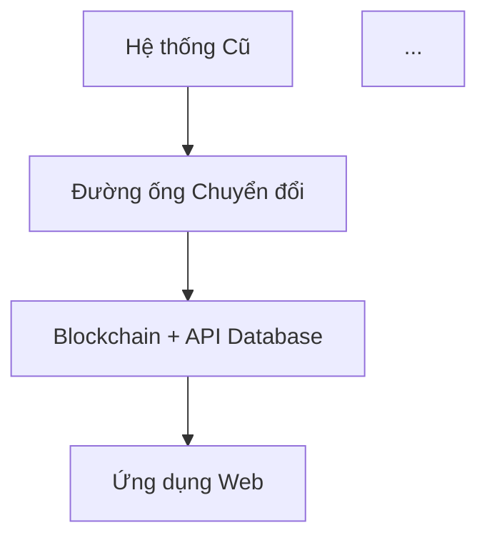
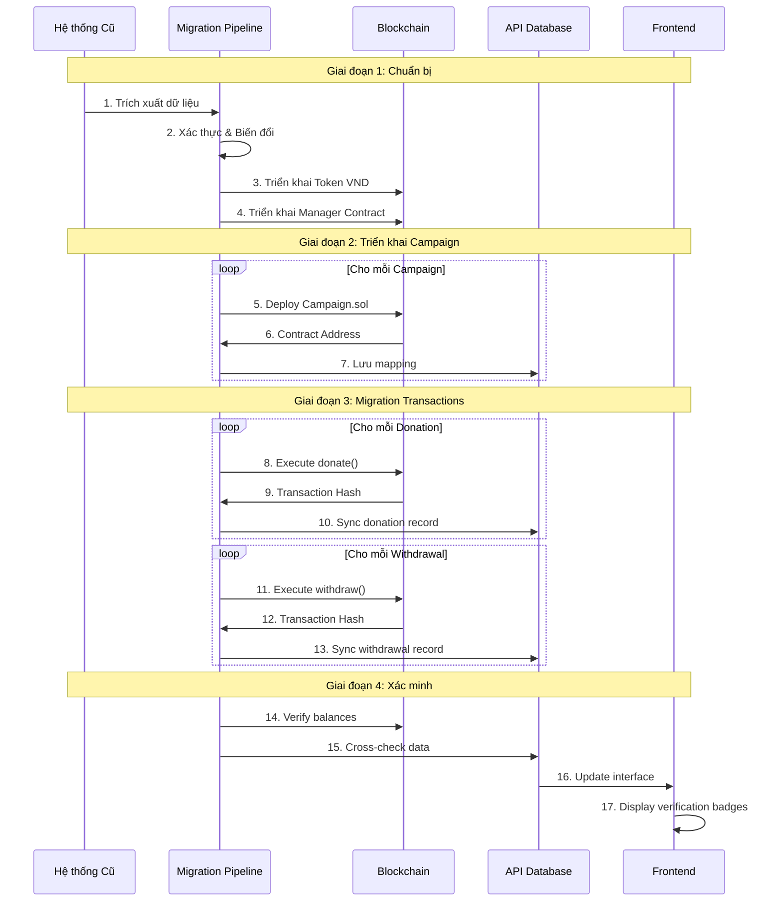
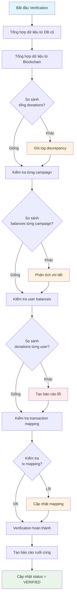
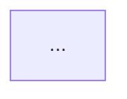

# TÀI LIỆU MIGRATION HỆ THỐNG TỪ THIỆN

## Mục lục
1. [Mục đích & Phạm vi](#1-mục-đích--phạm-vi)
2. [Kiến trúc chuyển đổi](#2-kiến-trúc-chuyển-đổi)
3. [Quy trình chuyển đổi chi tiết](#3-quy-trình-chuyển-đổi-chi-tiết)
4. [Tích hợp API & Cơ sở dữ liệu](#4-tích-hợp-api--cơ-sở-dữ-liệu)
5. [Tích hợp giao diện người dùng](#5-tích-hợp-giao-diện-người-dùng)
6. [An toàn & Tuân thủ](#6-an-toàn--tuân-thủ)
7. [Quản lý rủi ro & tình huống khẩn cấp](#7-quản-lý-rủi-ro--tình-huống-khẩn-cấp)
8. [Tiêu chí thành công & xác thực](#8-tiêu-chí-thành-công--xác-thực)
9. [Thời gian & tài nguyên](#9-thời-gian--tài-nguyên)
10. [Sơ đồ tổng quan & kỹ thuật](#10-sơ-đồ-tổng-quan--kỹ-thuật)
11. [Kết luận](#11-kết-luận)

---

## 1. Mục đích & Phạm vi

### 1.1 Mục đích chuyển đổi
- Chuyển đổi toàn bộ dữ liệu từ hệ thống từ thiện hiện tại sang blockchain Avalanche C-Chain.
- Nâng cao tính minh bạch, khả năng kiểm chứng và tự động hóa quy trình quyên góp.

### 1.2 Phạm vi dữ liệu
- **Người dùng:** >10,000 tài khoản
- **Chiến dịch:** >3,000 chiến dịch
- **Giao dịch quyên góp:** >12,500 giao dịch (2023-2025)
- **Giao dịch rút tiền:** >180 giao dịch
- **Tệp phương tiện:** Hình ảnh, video, tài liệu

### 1.3 Hệ thống đích
- **Blockchain:** Avalanche C-Chain (Fuji Testnet)
- **Smart Contracts:** Campaign.sol, Manager.sol, CurrencyConvert.sol, Token.sol
- **API Backend:** MetaFi Charity API v1
- **Frontend:** React App tích hợp blockchain

---

## 2. Kiến trúc chuyển đổi

### 2.1 Tổng quan kiến trúc
```
Hệ thống Cũ → Đường ống Chuyển đổi → Blockchain + API DB → Ứng dụng Web
```

### 2.2 Thành phần chính
- **Nguồn:** MySQL/PostgreSQL, file storage, xác thực người dùng
- **Pipeline:** Trích xuất, xác thực, deploy contract, đồng bộ API
- **Đích:** Smart contract độc lập, token VND, MongoDB, AWS S3, React

### 2.3 Luồng dữ liệu chuyển đổi
1. Trích xuất
2. Biến đổi
3. Triển khai
4. Giao dịch blockchain
5. Đồng bộ API
6. Xác minh

---

## 3. Quy trình chuyển đổi chi tiết

### 3.1 Chuẩn bị
- Kiểm toán, sao lưu, thiết lập môi trường, trích xuất dữ liệu

### 3.2 Triển khai blockchain
- Deploy token, contract chuyển đổi, quản lý, tạo ví, ánh xạ user

### 3.3 Chuyển đổi dữ liệu
- Gọi donate/withdraw, mapping, đồng bộ API, upload media

### 3.4 Xác minh
- Đối soát số dư, giao dịch, kiểm thử chức năng

---

## 4. Tích hợp API & Cơ sở dữ liệu

### 4.1 Cấu trúc bản ghi quyên góp
```json
{
  "id": "mã_quyên_góp_duy_nhất",
  "campaign_id": "tham_chiếu_chiến_dịch", 
  "user_id": "id_người_quyên_góp",
  "donor_wallet_address": "0x...",
  "token_address": "0x...",
  "token_symbol": "VND",
  "amount_original": "số_tiền_quyên_góp",
  "amount_wei": "số_tiền_định_dạng_blockchain",
  "blockchain_tx_hash": "0x...",
  "bank_transaction_id": "tham_chiếu_cũ",
  "message": "tin_nhắn_người_quyên_góp",
  "donation_time": "thời_gian_ISO",
  "block_number": "khối_blockchain",
  "gas_used": "gas_giao_dịch",
  "tx_fee": "phí_gas",
  "status": "ĐÃ_XÁC_NHẬN",
  "migration_source": true,
  "explorer_url": "liên_kết_explorer_blockchain"
}
```

### 4.2 Cấu trúc ánh xạ chiến dịch
```json
{
  "legacy_campaign_id": "id_hệ_thống_cũ",
  "blockchain_contract_address": "0x...",
  "manager_contract_address": "0x...", 
  "admin_wallet_address": "0x...",
  "creation_tx_hash": "0x...",
  "migration_timestamp": "thời_gian_ISO",
  "verification_status": "ĐÃ_XÁC_MINH"
}
```

### 4.3 Ánh xạ ví người dùng
```json
{
  "legacy_user_id": "id_người_dùng_cũ",
  "blockchain_wallet_address": "0x...",
  "private_key_encrypted": "khóa_riêng_mã_hóa",
  "seed_phrase_encrypted": "cụm_từ_seed_mã_hóa",
  "initial_vnd_balance": "số_token_chuyển_đổi",
  "wallet_creation_tx": "0x...",
  "migration_status": "HOÀN_THÀNH"
}
```

---

## 5. Tích hợp giao diện người dùng

- Hiển thị badge xác minh blockchain, liên kết explorer, lịch sử quyên góp, trạng thái migration, dashboard xác minh quản trị.

---

## 6. An toàn & Tuân thủ

- Mã hóa dữ liệu, quản lý khóa, kiểm toán, tuân thủ GDPR, xác minh đa cấp, kiểm soát truy cập, đa chữ ký.

---

## 7. Quản lý rủi ro & tình huống khẩn cấp

- Backup, rollback, khôi phục, cảnh báo, hỗ trợ người dùng, đào tạo đội ngũ.

---

## 8. Tiêu chí thành công & xác thực

- 100% dữ liệu chuyển đổi, không sai lệch tài chính, lỗi giao dịch <0.1%, xác minh người dùng >95%, tăng niềm tin người dùng.

---

## 9. Thời gian & tài nguyên

- **Tổng thời gian:** 7 tuần (chuẩn bị, triển khai, chuyển đổi, xác minh)
- **Nhân sự:** 3-4 dev blockchain, 2 QA, 1 PM
- **Hạ tầng:** Avalanche testnet, AWS, API

---

## 10. Sơ đồ tổng quan & kỹ thuật

### 10.1 Sơ đồ Kiến trúc Migration
*Minh họa các thành phần chính và mối liên hệ trong toàn bộ hệ thống migration.*


### 10.2 Sơ đồ Luồng Dữ liệu Chi tiết
*Trình tự các bước xử lý dữ liệu từ hệ thống cũ sang blockchain và frontend.*


### 10.3 Sơ đồ Migration Timeline (Gantt)
*Quản lý thời gian, các giai đoạn và dependencies của migration.*
```mermaid
gantt
    ...
```

### 10.4 Sơ đồ Smart Contract
*Thiết kế kỹ thuật các smart contract chính trong hệ thống.*
```mermaid
classDiagram
    ...
```

### 10.5 Sơ đồ Luồng Xử lý Donation Migration
*Quy trình từng bước xử lý migration cho từng donation.*
```mermaid
flowchart TD
    A[Bắt đầu Migration Donations] --> B[Lấy danh sách donations từ DB cũ]
    B --> C[Sắp xếp theo thời gian]
    C --> D[Lấy donation đầu tiên]
    
    D --> E{Kiểm tra user wallet?}
    E -- Chưa có --> F[Tạo wallet cho user]
    E -- Đã có --> G[Lấy wallet address]
    F --> G
    
    G --> H[Mint VND token tương ứng]
    H --> I[Approve token cho Campaign contract]
    I --> J[Gọi Campaign.donate()]
    
    J --> K{Transaction thành công?}
    K -- Không --> L[Retry với gas cao hơn]
    K -- Có --> M[Lưu transaction hash]
    L --> J
    
    M --> N[Sync với API database]
    N --> O[Cập nhật mapping legacy_id -> tx_hash]
    O --> P{Còn donations nào không?}
    P -- Có --> Q[Lấy donation tiếp theo]
    P -- Không --> R[Hoàn thành]
    
    Q --> D
    
    style A fill:#e1f5fe
    style R fill:#e8f5e8
    style F fill:#fff3e0
    style L fill:#ffebee
```

### 10.6 Sơ đồ Verification Process
*Đảm bảo tính chính xác, đối soát dữ liệu giữa hệ thống cũ và blockchain.*


### 10.7 Sơ đồ Cấu trúc Dữ liệu API
*Minh họa cấu trúc bảng dữ liệu chính của API backend.*
```mermaid
erDiagram
    ...
```

### 10.8 Sơ đồ Monitoring Dashboard
*Theo dõi tiến độ migration, sức khỏe hệ thống và độ chính xác dữ liệu.*
```mermaid
dashBoard
    ...
```

### 10.9 Sơ đồ Emergency Recovery Plan
*Quy trình xử lý sự cố, rollback và khôi phục migration.*


### 10.10 Sơ đồ User Experience Flow
*Trải nghiệm người dùng trước, trong và sau migration.*
```mermaid
journey
    ...
```

### 10.11 Sơ đồ Quyền & Phân vai Migration
*Phân quyền, trách nhiệm và phối hợp giữa các vai trò trong migration.*


### 10.12 Sơ đồ Alert & Notification Flow
*Quy trình cảnh báo, thông báo khi có lỗi hoặc sự kiện quan trọng trong migration.*


### 10.13 Sơ đồ Quy trình Rollback Chi tiết
*Các bước rollback, khôi phục migration khi phát hiện lỗi nghiêm trọng.*


### 10.14 Sơ đồ Tích hợp Đa môi trường
*Quy trình migration thử nghiệm (staging) trước khi lên production.*


### 10.15 Sơ đồ Hỗ trợ Người dùng sau Migration
*Quy trình hỗ trợ, xác minh và giải đáp cho người dùng sau migration.*


---

## 11. Kết luận

Chuyển đổi dữ liệu sang blockchain là bước tiến lớn về minh bạch, tin cậy, tự động hóa cho nền tảng từ thiện. Thành công không chỉ ở kỹ thuật mà còn ở sự tin tưởng, xác minh và trải nghiệm người dùng.

